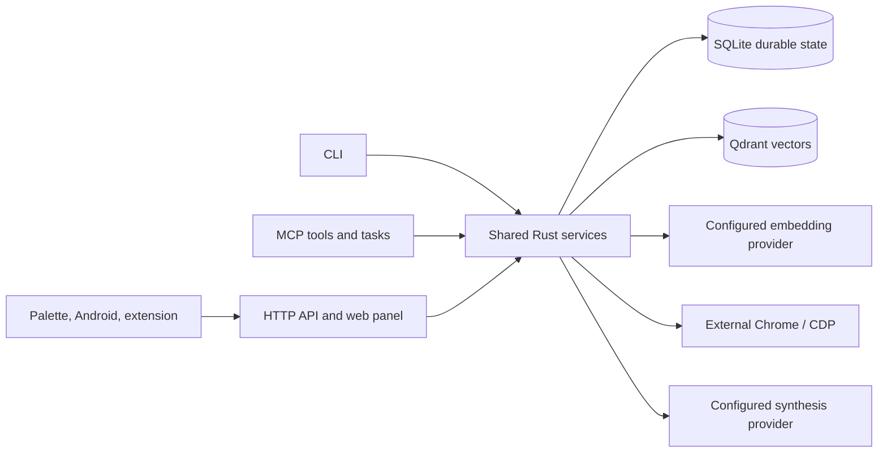
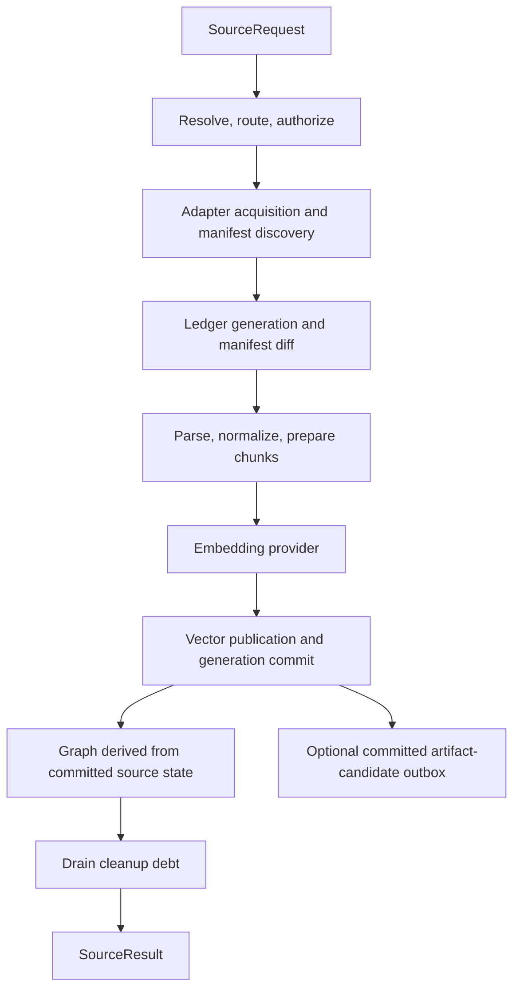
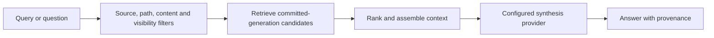

# Axon Architecture

Last reviewed: 2026-09-29

Axon exposes one Rust service layer through CLI, MCP, and HTTP/app surfaces.
The unified source pipeline is implemented, not a future migration. Source
acquisition, document preparation, embedding, publication, graph updates, and
cleanup share source identity, generations, and a durable job lifecycle.

The [source pipeline](source-pipeline.md), [crate ownership](crate-ownership.md),
and [crate map](crate-structure.md) provide the detailed boundaries. The
[pipeline-unification packet](../pipeline-unification/README.md) retains design
contracts and dated delivery notes; its old implementation examples are not
current operator commands.

## System context



SQLite owns durable jobs, source generations, manifests, document status, and
other application state. Qdrant stores the retrieval corpus. TEI and Chrome/CDP
are external providers, not alternate queue or lifecycle authorities. Provider
availability is operation-specific; a responding HTTP listener alone does not
prove a source job can embed or publish.

## Runtime ownership

| Boundary | Owning code | Responsibility |
|---|---|---|
| Public DTOs and errors | [axon-api](../../crates/axon-api/), [axon-error](../../crates/axon-error/) | Transport-neutral contracts and typed diagnostics |
| Configuration and common policy | [axon-core](../../crates/axon-core/), [axon-authz](../../crates/axon-authz/) | Effective settings, HTTP/filesystem safety, authorization contracts |
| Source resolution | [axon-route](../../crates/axon-route/) | Canonical identity, adapter and scope selection |
| Acquisition | [axon-adapters](../../crates/axon-adapters/) | Materialize, discover, acquire, and normalize source documents |
| Source state | [axon-ledger](../../crates/axon-ledger/) | Generations, manifests, document status, leases, cleanup debt |
| Preparation | [axon-document](../../crates/axon-document/), [axon-parse](../../crates/axon-parse/), [axon-extract](../../crates/axon-extract/) | Parsing, preparation, chunking, extraction |
| Embeddings and publication | [axon-embedding](../../crates/axon-embedding/), [axon-vectors](../../crates/axon-vectors/) | Provider requests, vector writes, generation-aware visibility |
| Retrieval and synthesis | [axon-retrieval](../../crates/axon-retrieval/), [axon-llm](../../crates/axon-llm/) | Filtered retrieval, ranking, synthesis backends |
| Graph, memory, cleanup | [axon-graph](../../crates/axon-graph/), [axon-memory](../../crates/axon-memory/), [axon-prune](../../crates/axon-prune/) | Derived state and bounded cleanup |
| Execution | [axon-jobs](../../crates/axon-jobs/) | SQLite jobs, attempts, stages, events, heartbeats, reservations |
| Composition | [axon-services](../../crates/axon-services/) | Cross-domain orchestration and shared transport-facing entry points |
| Codex control | [axon-codex](../../crates/axon-codex/) | Codex app-server integration used by shared services |
| Transports | [axon-cli](../../crates/axon-cli/), [axon-mcp](../../crates/axon-mcp/), [axon-web](../../crates/axon-web/) | Parse, authorize, call services, render responses |

A source adapter emits `SourceDocument` values, not persisted chunks, vectors,
or transport responses. Transports must not reach into a domain crate's
internal `::ops::*` modules. Single-domain logic belongs to its owning crate;
`axon-services` composes domains and owns job-aware orchestration. The
[layering check](dependency-layering.md) enforces this boundary.

## Entry points and configuration

| Surface | Entry point | Contract |
|---|---|---|
| CLI | `axon <command>` or `axon <source>` | In-process command execution; generic CLI-to-server forwarding is not supported |
| MCP stdio | `axon mcp` | Process transport, without an HTTP listener requirement |
| Unified HTTP | `axon serve` | Web panel, MCP mount, and `/v1` REST routes on the configured listener |
| MCP HTTP | `axon serve mcp` or configured MCP HTTP transport | Same HTTP authorization boundary |

MCP discovery includes legacy/atomic tool projections, auxiliary dashboard
tools, resources, and task behavior. The primary action enum is not the full
catalog. See [MCP overview](../reference/mcp/overview.md) and
[HTTP reference](../reference/http-api.md).

Configuration precedence is **CLI > environment > TOML > defaults**. Typed
parsing and validation live in `axon-core`; transports consume effective
configuration rather than implementing their own precedence rules.
[Configuration](../guides/configuration.md) explains file loading and reload
requirements; the [generated configuration reference](../reference/config/)
provides keys and defaults. An example file is not evidence of the running
process configuration.

## Unified source pipeline

The entry points in
[`axon-services::source`](../../crates/axon-services/src/source.rs) resolve
and authorize a `SourceRequest`, invoke adapter-owned acquisition, and run
the shared document/publication pipeline.



The exact stage sequence and no-embed/map branches are described in
[source-pipeline.md](source-pipeline.md). Important invariants are:

- One source job ID spans the pipeline. Source family names do not create
  separate crawl, ingest, or embedding queues or child-job handoffs.
- Stable source/item identity and hashes allow unchanged items to skip
  preparation and re-embedding. Added, modified, removed, and unchanged items
  are distinct outcomes. Deletions require a complete snapshot or explicit
  tombstone, never a truncated page or interrupted acquisition.
- Preparation and publication are shared service orchestration, not duplicated
  inside each adapter. Cleanup must also cover failure and cancellation paths.
- Publishing makes the new generation visible. Graph updates follow
  publication; cleanup debt tracks work that cannot safely finish immediately.
- Optional artifact candidates are evidence associated with the same job and
  generation. Delivery failure after commit does not roll back published RAG
  state or authorize another source pipeline.

### Web acquisition and map

The web adapter uses the shared HTTP/Chrome acquisition ladder and HTTP safety
policy. Spider integration is in
[`axon-adapters`](../../crates/axon-adapters/Cargo.toml), not a separate
`axon-crawl` crate. Render and discovery options are documented in
[web crawls](../guides/web-crawls.md) and
[Spider feature flags](../reference/spider-feature-flags.md).

`axon scrape <url>` is a page-scoped convenience projection.
`axon <url> --scope site` or `--scope docs` submits multi-page source work.
`map` is bounded discovery, not a crawl-output or child-embedding handoff.
The current CLI and transport projections are generated in
[action reference](../reference/actions/) and
[API parity](../reference/api-parity.md).

### Other acquisition families

Local files, hosted Git, feeds, registries, Reddit, YouTube, sessions, uploads,
and authorized CLI/MCP tools reuse the same adapter and source contracts.
Use the [adapter scope registry](../reference/sources/adapter-scopes.md) for
supported scopes, and [source onboarding](../development/adding-source.md)
when extending acquisition. Provider metadata discovery does not grant
permission to execute a tool.

## Durable jobs and workers

Jobs are SQLite-backed; workers run in-process in a Tokio runtime.
[`axon-jobs`](../../crates/axon-jobs/) owns attempts, stages, event history,
heartbeats, cancellation, recovery, and provider reservations. There are no
separate `axon_crawl_jobs`, `axon_embed_jobs`, or `axon_ingest_jobs` tables in
the current source lifecycle.

A detached response is acceptance, not completion. The local CLI attempts to
ensure a worker process exists; a long-lived `axon serve` or `axon jobs worker`
can also drain the queue. Verify the job's actual terminal status and
diagnostics. `--wait true` runs with active workers and waits for completion;
a wait timeout is not evidence that a durable job was canceled.

```bash
axon https://example.com --scope site --wait true
axon jobs list
axon jobs get <job_id>
axon jobs events <job_id>
```

Use the [jobs reference](../reference/runtime/jobs.md) for lifecycle states,
retry/recovery prerequisites, event streams, and retention. A retry belongs to
the same durable job, not a new per-family queue. Cancellation is observed at
safe boundaries; inspect completed work and side effects before repeating a
write. Destructive cleanup and reset require their documented plan and
confirmation flows.

## Retrieval, synthesis, and visibility



`axon-retrieval` owns retrieval; `axon-embedding` owns embedding provider
requests and retry/cooling behavior; `axon-vectors` owns vector upserts and
publication. `axon-llm` owns synthesis backends. `axon-services` composes these
for ask/research and other cross-domain workflows.

Queries must honor committed generations and requested filters. A refresh or
removal must not leave old content retrievable merely because vector insertion
succeeded. See [ask/RAG](../guides/ask-rag.md),
[vector payload](../reference/sources/vector-payload.md), and
[ledger](../reference/runtime/ledger.md).

## Persistence and artifacts

| Store | Authority |
|---|---|
| SQLite | Durable jobs and source state; owning crate migrations define tables and upgrades |
| Qdrant | Published vectors and payloads used for retrieval |
| Artifact/document stores | Acquired or produced content referenced by durable records |
| Graph and memory stores | Derived relationships and retained memory under their owning contracts |

Use [database schema](../reference/runtime/database-schema.md) and its
[provenance-bearing JSON](../reference/runtime/database-schema.json), rather
than copying a table inventory here. Applied migrations are immutable; add
new migrations and test existing-state upgrades.

Public artifact responses carry opaque IDs, not server filesystem paths.
Follow the transport's artifact resource contract instead of reconstructing
private paths from filenames.

## Authorization, diagnostics, and deployment

Non-loopback HTTP requires `AXON_HTTP_TOKEN` or OAuth. Panel password/session
unlock is separate from API/MCP authorization. Do not use an API token as a
panel password or treat a local CLI identity as a remote caller identity.
Source acquisition also enforces SSRF/filesystem boundaries; CLI/MCP tool
execution requires authorization, allowlists, timeouts, output caps, and
redaction. See [security](../operations/security.md).

Failures and degraded results must identify the operation/stage, affected
entity, safe cause, correlated job/source/item IDs, retryability, and concrete
recovery action. Distinguish partial completion from an empty success. Unknown
commit status must be explicit so a caller does not blindly repeat writes.
Structured results go to stdout and diagnostics/logs to stderr.
[Error contracts](../pipeline-unification/runtime/error-handling.md) and
[observability](../reference/runtime/observability.md) define the details.

The supported production contract is native `axon serve` under systemd in
Incus or bare-metal Linux, with external providers. Compose is a development
and reference surface. Use [deployment](../operations/deployment.md) and
verified installation notes for lifecycle commands; do not infer the deployed
service manager from a repository example.

## Keeping this map current

When behavior changes, update the owning code, generated contracts, and the
relevant task/reference guide together. Run the
[documentation checks](../development/documentation.md); source/schema
changes additionally require their affected tests and ordered generated-contract
refresh/check. Historical reports are evidence of their recorded revision,
not an alternate current architecture.
