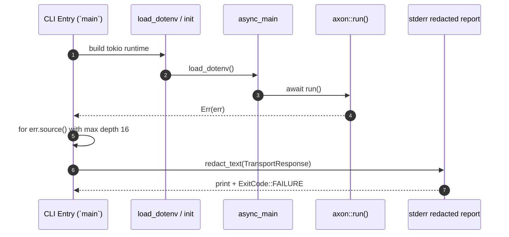
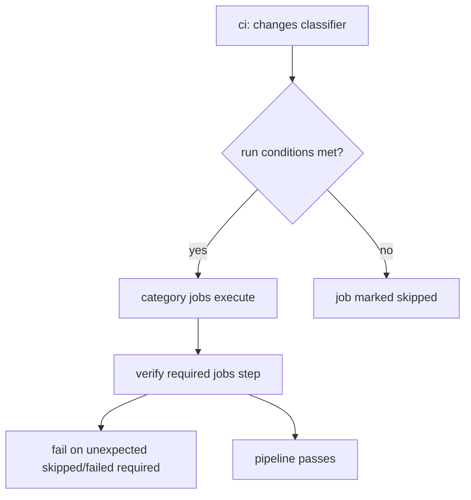

# Architecture Overview

## Scope

This snapshot covers the most material architectural changes between `e461da278357bb594c62408b6cfb34cf47a91e14` and `e7d34a6b`.

- `src/main.rs`: startup error reporting and redaction behavior.
- `.github/workflows/ci.yml`: CI gate restoration and workflow-control policy.
- `.github/workflows/openwiki-update.yml`: preflight-backed OpenWiki automation and PR payload changes.
- `scripts/cargo-rustc-wrapper`: wrapper delegation and caching fallback order.
- `scripts/generate_action_docs.py` plus generated action/parity docs (`docs/reference/api-parity.md`, `docs/reference/actions/*`) 

## Runtime behavior impact

`src/main.rs` remains the process boundary before `axon::run()`, but now walks nested causes before redaction so failure logs preserve actionable context while still being scrubbed:

Caption: Axon CLI startup error-flow now preserves nested causes while keeping redaction.

## CI and OpenWiki control architecture

The CI control plane was tightened around the same core paths as before, with temporary blocks removed:

- Many jobs were moved from `if: ${{ false && ... }}` to conditional execution via change-class predicates.
- New or revised checks were added for docs-surface parity and generation (`mcp-schema-doc-sync`, `chrome-extension`, and docs gate enforcement logic).
- Final verification now distinguishes expected skips from unexpected failures.

`openwiki-update.yml` now includes:

- a preflight call to the configured OpenAI-compatible API endpoint,
- explicit secret guardrails before running `openwiki --update --print`,
- and an expanded PR file list (`openwiki`, `AGENTS.md`, `CLAUDE.md`, workflow file).

Caption: CI job gating and terminal verification model.

`scripts/cargo-rustc-wrapper` is now behaviorally configurable:

- explicit helper (`CARGO_BIN_ARTIFACT_WRAPPER_HELPER`) or auto-discovered `cargo-bin-artifact-wrapper`,
- then `sccache-wrapper` / `sccache`,
- then direct `rustc`.

## Source-to-doc generation model

`scripts/generate_action_docs.py` was updated so removed compatibility source commands map to the unified `source` path and compatibility note lines are explicit in generated surface blocks, keeping docs aligned with actual dispatch.

## Recommended reading order

1. [source-map.md](../source-map.md) for changed file inventory.
2. [workflows.md](../workflows.md) for precise workflow behavior.
3. [domain-concepts.md](../domain-concepts.md) for action-surface concepts and compatibility behavior.
4. [testing.md](../testing.md) for validation commands.
